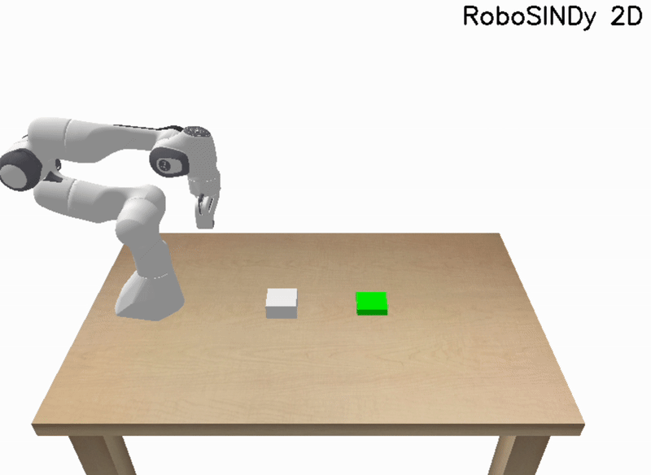

# RoboSINDy

     

    <em>Fig 1: RoboSINDy at work on the planar pushing task. We simulate the task with a Franka Panda Arm in a PyBullet simulation environment.</em>

"Data-driven discovery of coordinates and governing equations," Champion et al. applied to a robot arm in simulator. 
This code is developed by Advaith Balaji and Julian Skifstad as part of the final project for ROB 498: Robot Learning for Planning and Control, Winter 2025 at the University of Michigan.

# Instructions to run this code

Run `python demo.py` from the root directory of this repository to view 3 planar pushing trials per model.
